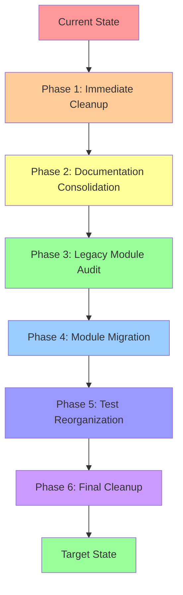
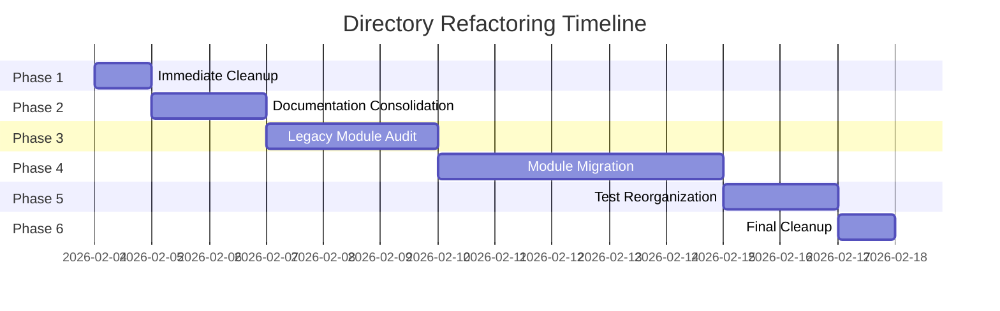

# Directory Refactoring Visualization

## Current State vs Target State

### Current State (Complex, Mixed Paradigms)

```
03_Game/ (CURRENT - HIGH COMPLEXITY)
│
├── 📄 README.md
├── 📄 AGENTS.md
├── 📄 USER_GUIDE.md
├── 📄 ARCHITECTURE_MIGRATION.md
├── 📄 COMPREHENSIVE_SIMULATION_REFACTOR_PLAN.md  ⚠️
├── 📄 COMPREHENSIVE_REFACTOR_PLAN_PHASE_10.md    ⚠️
├── 📄 UPGRADE_Proposal_*.md                       ⚠️
├── 📄 PHASE1_IMPLEMENTATION_SUMMARY.md            ⚠️
├── 📄 PHASE2_IMPLEMENTATION_SUMMARY.md            ⚠️
├── 📄 PHASE3_IMPLEMENTATION_SUMMARY.md            ⚠️
├── 📄 PHASE4_IMPLEMENTATION_SUMMARY.md            ⚠️
├── 📄 PHASE5_IMPLEMENTATION_SUMMARY.md            ⚠️
├── 📄 PHASE_8_COMPLETION_SUMMARY.md               ⚠️
├── 📄 PHASE_8_VALIDATION_REPORT.md                ⚠️
│
├── 📁 docs/ (11 files)
│   ├── API.md
│   ├── ARCHITECTURE.md
│   ├── BENCHMARKS.md
│   └── ...
│
├── 📁 src/ (313 files, 85+ directories)
│   ├── 📄 main.rs                              ✅ ACTIVE
│   ├── 📄 main_old.rs                          ❌ LEGACY
│   ├── 📄 lib.rs                              ⚠️ MIXED (662 lines)
│   ├── 📄 audit_runner.rs                     ⚠️ UNKNOWN
│   ├── 📄 philosophical_tests.rs.backup        ❌ BACKUP
│   ├── 📄 matter.rs.backup                     ❌ BACKUP
│   │
│   ├── 📁 foundation/                          ✅ V3.0
│   ├── 📁 spectrum/                            ✅ V3.0
│   ├── 📁 entity_layer7/                       ✅ V3.0
│   ├── 📁 evolution_density_octave/            ✅ V3.0
│   ├── 📁 consciousness/                       ✅ V3.0
│   ├── 📁 memory/                              ✅ V3.0
│   ├── 📁 simulation_v3/                       ✅ V3.0
│   ├── 📁 adapters/                            ✅ V3.0
│   ├── 📁 infrastructure/                      ✅ V3.0
│   ├── 📁 integration/                         ✅ V3.0
│   │
│   ├── 📁 layers/                              ⚠️ DUPLICATE
│   │   ├── layer0_violet_ray/
│   │   ├── layer1_indigo_ray/
│   │   ├── layer2_blue_ray/
│   │   ├── layer3_green_ray/
│   │   ├── layer4_yellow_ray/
│   │   ├── layer5_orange_ray/
│   │   └── layer6_red_ray/
│   │
│   ├── 📁 holographic/                         ❌ DUPLICATE (7 modules)
│   ├── 📁 evolution/                           ❌ DUPLICATE (4 modules)
│   ├── 📁 soul_stream/                         ❌ DUPLICATE
│   ├── 📁 veil/                                ❌ DUPLICATE
│   ├── 📁 physical_manifestation/              ❌ DUPLICATE
│   ├── 📁 matter/                              ❌ DUPLICATE
│   │
│   ├── 📁 bin_disabled/                        ❌ DELETE (10 files)
│   │   ├── test_debug_*.rs                     ❌ DELETE
│   │   ├── test_rng*.rs                        ❌ DELETE
│   │   └── test_phase1_*.rs                    ❌ DELETE
│   │
│   ├── 📁 tests/                               ⚠️ INCONSISTENT
│   ├── 📁 force_emergence_tests/               ❌ LEGACY
│   ├── 📁 cross_layer_integration_tests/       ❌ LEGACY
│   ├── 📁 performance_optimization/            ❌ LEGACY
│   ├── 📁 performance_optimization_tests/      ❌ LEGACY
│   │
│   ├── 📄 phase7_validation_tests.rs           ⚠️ INCONSISTENT
│   ├── 📄 phase8_validation_tests.rs           ⚠️ INCONSISTENT
│   │
│   └── [30+ legacy module files]               ❌ LEGACY
│
├── 📁 tests/ (19 files)
│   ├── phase0_foundation.rs                    ✅
│   ├── phase1_integration.rs                   ✅
│   ├── phase2_integration.rs                   ✅
│   ├── ❌ phase3_integration.rs (MISSING)
│   ├── ❌ phase4_integration.rs (MISSING)
│   ├── ❌ phase5_integration.rs (MISSING)
│   ├── ❌ phase6_integration.rs (MISSING)
│   ├── ❌ phase7_integration.rs (MISSING)
│   ├── phase10_validation.rs                   ✅
│   ├── ❌ phases 11-14 (MISSING)
│   ├── phase15_veil_integration.rs             ✅
│   ├── phase16_reality_generation_integration.rs ✅
│   ├── phase17_* tests (4 files)               ✅
│   ├── accuracy_tests.rs                       ⚠️ INCONSISTENT
│   ├── emergence_tests.rs                      ⚠️ INCONSISTENT
│   └── ...
│
├── 📁 benches/ (4 files)                       ✅ OK
│
├── 📁 scripts/ (1 file)                        ✅ OK
│
├── 📄 test_physics_module.rs                   ❌ WRONG LOCATION
├── 📄 test_foundation.rs                       ❌ WRONG LOCATION
├── 📄 test_desc.rs                             ❌ WRONG LOCATION
│
└── 📄 test_foundation (ELF binary)             ❌ ARTIFACT
```

**Legend**:
- ✅ Active/Correct
- ❌ Legacy/Delete
- ⚠️ Review/Consolidate

---

### Target State (Clean, V3.0 Architecture)

```
03_Game/ (TARGET - CLEAN ORGANIZATION)
│
├── 📄 README.md
├── 📄 AGENTS.md
├── 📄 USER_GUIDE.md
├── 📄 CHANGELOG.md                             ✅ NEW (consolidated)
│
├── 📁 docs/ (organized)
│   ├── 📁 user/                                ✅ User-facing
│   │   ├── ARCHITECTURE.md
│   │   ├── TUTORIAL.md
│   │   ├── GETTING_STARTED.md
│   │   ├── FAQ.md
│   │   └── TROUBLESHOOTING.md
│   │
│   └── 📁 developer/                           ✅ Developer-facing
│       ├── API.md
│       ├── DEVELOPMENT_GUIDE.md
│       ├── TESTING_GUIDE.md
│       └── ARCHITECTURE_MIGRATION.md
│
├── 📁 archive/ (historical)
│   ├── COMPREHENSIVE_SIMULATION_REFACTOR_PLAN.md     ✅ ARCHIVED
│   ├── COMPREHENSIVE_REFACTOR_PLAN_PHASE_10.md       ✅ ARCHIVED
│   ├── UPGRADE_Proposal_*.md                         ✅ ARCHIVED
│   └── phase_summaries/                              ✅ ARCHIVED
│       ├── PHASE1_IMPLEMENTATION_SUMMARY.md
│       ├── PHASE2_IMPLEMENTATION_SUMMARY.md
│       └── ... (all phase summaries)
│
├── 📁 src/ (clean, V3.0 only)
│   ├── 📄 main.rs                              ✅
│   ├── 📄 lib.rs                              ✅ (clean, <200 lines)
│   │
│   ├── 📁 foundation/                          ✅ V3.0 (Layers 0-3)
│   │   ├── mod.rs
│   │   ├── violet_realm.rs
│   │   ├── indigo_realm.rs
│   │   ├── blue_realm.rs
│   │   └── green_realm.rs
│   │
│   ├── 📁 spectrum/                            ✅ V3.0 (Layers 4-6)
│   │   ├── mod.rs
│   │   ├── yellow_realm.rs
│   │   ├── orange_realm.rs
│   │   └── red_realm.rs
│   │
│   ├── 📁 entity_layer7/                       ✅ V3.0 (Layer 7)
│   │   ├── mod.rs
│   │   └── layer7.rs
│   │
│   ├── 📁 evolution_density_octave/            ✅ V3.0
│   │   ├── mod.rs
│   │   ├── density_octave.rs
│   │   └── spectrum_access.rs
│   │
│   ├── 📁 consciousness/                       ✅ V3.0
│   │   ├── mod.rs
│   │   ├── free_will.rs
│   │   └── archetype22.rs
│   │
│   ├── 📁 memory/                              ✅ V3.0
│   │   ├── mod.rs
│   │   ├── holographic_memory.rs
│   │   └── soul_stream.rs
│   │
│   ├── 📁 simulation_v3/                       ✅ V3.0
│   │   ├── mod.rs
│   │   ├── involution_sequence.rs
│   │   ├── entity_lifecycle.rs
│   │   ├── holographic_field.rs
│   │   ├── catalyst_system.rs
│   │   ├── collective_dynamics.rs
│   │   ├── environment.rs
│   │   ├── simulation_runner.rs
│   │   ├── statistics.rs
│   │   └── visualization.rs
│   │
│   ├── 📁 adapters/                            ✅ V3.0
│   │   ├── mod.rs
│   │   └── physical_adapter.rs
│   │
│   ├── 📁 infrastructure/                      ✅ V3.0
│   │   ├── mod.rs
│   │   └── common.rs
│   │
│   └── 📁 integration/                         ✅ V3.0
│       ├── mod.rs
│       └── integration.rs
│
├── 📁 tests/ (standardized, phase-based)
│   ├── fixtures.rs                            ✅
│   ├── utils.rs                               ✅
│   ├── phase0_tests.rs                        ✅
│   ├── phase1_tests.rs                        ✅
│   ├── phase2_tests.rs                        ✅
│   ├── phase3_tests.rs                        ✅ NEW
│   ├── phase4_tests.rs                        ✅ NEW
│   ├── phase5_tests.rs                        ✅ NEW
│   ├── phase6_tests.rs                        ✅ NEW
│   ├── phase7_tests.rs                        ✅ NEW
│   ├── phase8_tests.rs                        ✅
│   ├── phase9_tests.rs                        ✅ NEW
│   ├── phase10_tests.rs                       ✅
│   ├── phase11_tests.rs                       ✅ NEW
│   ├── phase12_tests.rs                       ✅ NEW
│   ├── phase13_tests.rs                       ✅ NEW
│   ├── phase14_tests.rs                       ✅ NEW
│   ├── phase15_tests.rs                       ✅
│   ├── phase16_tests.rs                       ✅
│   └── phase17_tests.rs                       ✅
│
├── 📁 benches/ (unchanged)
│   ├── phase17_2_performance_benchmark.rs     ✅
│   ├── involution_benchmark.rs                ✅
│   ├── evolution_benchmark.rs                 ✅
│   └── entity_benchmark.rs                    ✅
│
├── 📁 scripts/ (unchanged)
│   └── validate_performance.sh                ✅
│
├── 📄 Cargo.toml                              ✅ (cleaned)
└── 📄 .gitignore                              ✅ (updated)
```

---

## Refactoring Flow



---

## Module Migration Mapping

### Holographic Modules (7 → 1)

| Source Module | Target Module | Action |
|---------------|---------------|--------|
| `holographic/` | `simulation_v3/holographic_field.rs` | Merge |
| `holographic_complex/` | `simulation_v3/` | Extract unique code |
| `holographic_properties/` | `simulation_v3/` | Extract unique code |
| `holographic_reference/` | `memory/holographic_memory.rs` | Merge |
| `holographic_seed/` | `foundation/` | Extract unique code |
| `holographic_archetypical_mind/` | `spectrum/archetypical_mind.rs` | Merge |
| `holographic_connections/` | `simulation_v3/collective_dynamics.rs` | Merge |

### Evolution Modules (4 → 1)

| Source Module | Target Module | Action |
|---------------|---------------|--------|
| `evolution/` | `simulation_v3/entity_lifecycle.rs` | Merge |
| `evolution_density_octave/` | `evolution_density_octave/` | Keep (V3.0) |
| `evolution_process/` | `simulation_v3/entity_lifecycle.rs` | Merge |
| `evolution_chain/` | `evolution_density_octave/` | Merge |

### Soul Stream Modules (2 → 1)

| Source Module | Target Module | Action |
|---------------|---------------|--------|
| `soul_stream/` | `memory/soul_stream.rs` | Merge |
| `memory/` | `memory/` | Keep (V3.0) |

### Veil Modules (2 → 1)

| Source Module | Target Module | Action |
|---------------|---------------|--------|
| `veil/` | `spectrum/veil.rs` | Merge |
| `enhanced_veil/` | `spectrum/veil.rs` | Merge |

### Physical Modules (2 → 1)

| Source Module | Target Module | Action |
|---------------|---------------|--------|
| `physical_manifestation/` | `adapters/physical_adapter.rs` | Merge |
| `matter/` | `simulation_v3/` | Extract unique code |

### Free Will Modules (3 → 1)

| Source Module | Target Module | Action |
|---------------|---------------|--------|
| `free_will_capacity/` | `consciousness/free_will.rs` | Merge |
| `free_will_integration/` | `consciousness/free_will.rs` | Merge |
| `consciousness/` | `consciousness/` | Keep (V3.0) |

---

## Risk Assessment Matrix

| Phase | Risk Level | Mitigation Strategy |
|-------|------------|---------------------|
| Phase 1: Immediate Cleanup | 🟢 LOW | Clear backup files, no code impact |
| Phase 2: Documentation Consolidation | 🟢 LOW | Documentation only, no code changes |
| Phase 3: Legacy Module Audit | 🟡 MEDIUM | Careful analysis, document everything |
| Phase 4: Module Migration | 🔴 HIGH | Test thoroughly, commit frequently |
| Phase 5: Test Reorganization | 🟡 MEDIUM | Ensure test coverage maintained |
| Phase 6: Final Cleanup | 🟢 LOW | Verification only, no code impact |

---

## Success Metrics

### Before Refactoring
- **Total Rust files**: 313
- **Total directories**: 85+
- **lib.rs lines**: 662
- **Legacy modules**: 30+
- **Duplicate modules**: 5+ (22+ files)
- **Test coverage gaps**: 5 phases
- **Documentation files**: 26 (scattered)

### After Refactoring (Target)
- **Total Rust files**: ~150 (52% reduction)
- **Total directories**: ~25 (70% reduction)
- **lib.rs lines**: ~200 (70% reduction)
- **Legacy modules**: 0
- **Duplicate modules**: 0
- **Test coverage gaps**: 0
- **Documentation files**: ~15 (organized)

### Improvement Targets
- ✅ **50%+ reduction in file count**
- ✅ **70%+ reduction in directory count**
- ✅ **70%+ reduction in lib.rs complexity**
- ✅ **100% elimination of legacy modules**
- ✅ **100% elimination of duplicate modules**
- ✅ **100% test coverage for all phases**
- ✅ **Organized documentation structure**

---

## Implementation Timeline



**Total Duration**: 14 days (2 weeks)

---

## Next Steps

1. ✅ **Review this visualization** with team
2. ✅ **Approve refactoring plan**
3. ✅ **Execute Phase 1** (Immediate Cleanup)
4. ✅ **Begin Phase 3** (Legacy Module Audit)
5. ✅ **Track progress** using todo list

---

**Visualization End**

For questions or clarifications, refer to DIRECTORY_STRUCTURE_AUDIT_REPORT.md
Date: February 4, 2026